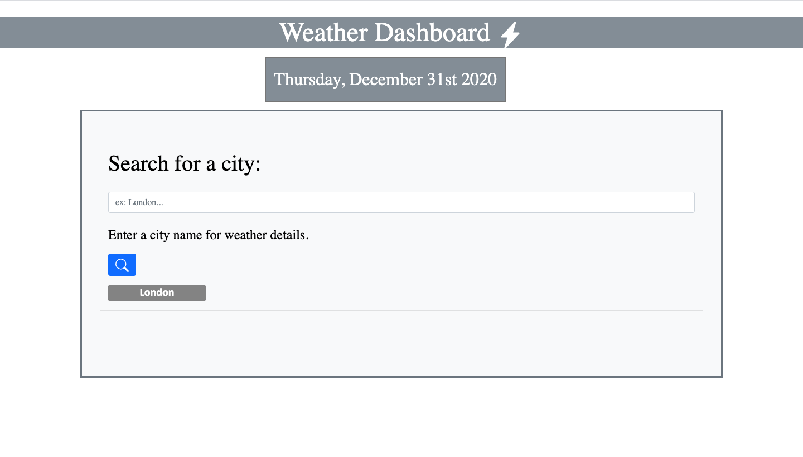

# Weather Dashboard

Objective: To build a weather dashboard that will display a city's weather conditions and five day forecast.

Goal: By using data supplied by the Open Weather Map API, when a user visits the page, they are able to enter a city's name and obtain the current weather conditions in that location. They will be able to see the temperature, the humidity, UV index and wind speed. The UV index is also color coded based on whether the conditions are favorable. Additionally, they will see the five day forecast with the weather and humidity for that day. The user will also be able to view the current date at the top - center of the page. Finally, when the user refreshes the page, they will be able to view the search history of the locations where they have previously checked the weather.

Screenshots:

Acknowlegements:
1) Weather API tutorial: Reviewed the tutorial for a refresher and guide to begin working on the homework. 
https://www.youtube.com/watch?v=BvU4L2C1wcI&t=128s

2) Tutor: I worked with a tutor, who was very helpful in explaining ways to use the open weather map api to pull information/make the api call and working with jquery to display it. 

3) Google Fonts: Ultilized Google Fonts for the Gilda Display and Calibri fonts.
https://fonts.google.com/

4) Bootstrap: Used some of Bootstrap's templates and customized the layout as needed. 
https://getbootstrap.com/

5) Moment.js: Used Moment.js to display the current date. 
https://momentjs.com/ 

6) Open Weather Map API: Utilized their free API to crete an API key and gather information for the current weather and 5 day forecast.
https://openweathermap.org/forecast5#5days 

Deployed link:  https://kokhobyohannes.github.io/WeatherDashboard/

Repository link:  https://github.com/KokhobYohannes/WeatherDashboard
